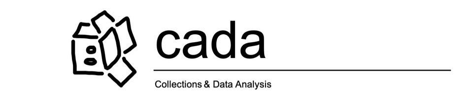

# CADA – An MMM Museum Analytics Pilot

Welcome to CADA, a Mountain Museum Management (MMM) Analytics Pilot Project!

## Introducing CADA

We are proud to present our very own museum analytics pilot. Our project is focused on illuminating potential benefits for museum collections professionals interested aligning their data work with their operational procedures and organizational values. Ranging from improving worker-experience of data entry, enhancing dataset integrity, visualizing collection diversity, to augmenting day-to-day operations and collections storage procedures. We want to automate our analysis processes specifically to make more time for collaborating alongside our clients and their teams.

Transparency is a core value of our project, as a show of good faith to our pilot participants and our team's preference for client autonomy and values in present and future decision-making. We try to assume as little as possible throughout the course of our analyses in order to better center our pilot participant's values.

Our team strongly values a bottom up approach, in analysis and in project outcomes, our data work begins where our clients express their needs. As consultants, we understand our position to be of witnessing our clients, and reflecting their strengths back onto the organizational practices in play. We want to ensure that all of our clients have complete ownership over their processes and the results of analysis. We are prepared to meet any data work practice as it is, not gatekeep with our own idea of how data work ought to be.

## In Practice
In the interest of motivating how data work could be relevant to museum professionals, our CADA team has prepared a protoype that includes extensive documentation which describe **how** and **why** we arrived at our decisions. All code is written to be as human-readable as possible, however reading the code is not necessary for understanding the project nor our team's practice. Ideally, we want to reveal our process and code so that museum professionals can understand our team's values as well as have code to take for future reference in their own data-driven endeavours.

## Contact us
If you have any questions about the analysis, the accompanying code, or just wanna chat about this project, check out our website: **museum-mgmt.com/cada**, or email me at: **marisol.yake(at)outlook.com**

<!-- **Project (expected) durations:**
**Project (expected) costs:** -->
____
## 3 Stages of Analysis
### Null Analysis
"Checking out the packaging" on the NYC MoMA artwork collections dataset. Reveals potential pain points in data work processes. 
**Link to file:** <a href="./examples/NYC_MoMA_Example/Collections Null Analysis.ipynb">Collections Null Analysis.ipynb</a>

### Exploratory Analysis
An extensive exploration of trends in found in the collections data.  Reveals historical trends about space-use and daily acquisitions. 
**Link to file:** <a href="./examples/NYC_MoMA_Example/Collections Null Analysis.ipynb">Collections Exploratory Data Analysis (EDA).ipynb</a>

### Time Series Forecasting
Applying statistical and ML modeling to estimate future collections.  Reveals how ML can assist museum professionals in decision-making. 
**Link to file:** <a href="./examples/NYC_MoMA_Example/Collections Null Analysis.ipynb">Collections Null Analysis.ipynb</a>
____
## Data Analysis Tools
Python - A general purpose programming language, very popular in the programming community for its readability and ease-of-use.

**Libraries** 
Jupyter Notebook – Data storytelling tool 
Pandas – Data handling & analysis library 
Seaborn – Data visualization library 
Darts – Time Series Forecasting Toolkit 
Sklearn – ML Pipeline Toolkit 

<!--
____
## License

-->
