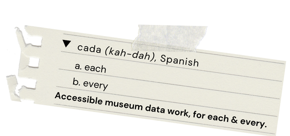

# CADA – An MMM Museum Analytics Pilot

Welcome to CADA, a Mountain Museum Management (MMM) Analytics Pilot Project!

## Introducing CADA

We are proud to present our very own museum analytics pilot. Our project is focused on illuminating potential benefits for museum collections professionals interested aligning their data work with their operational procedures and organizational values. Ranging from improving worker-experience of data entry, enhancing dataset integrity, visualizing collection diversity, to augmenting day-to-day operations and collections storage procedures. We want to automate our analysis processes specifically to make more time for collaborating alongside our clients and their teams.

Transparency is a core value of our project, as a show of good faith to our pilot participants and our team's preference for client autonomy and values in present and future decision-making. We try to assume as little as possible throughout the course of our analyses in order to better center our pilot participant's values.

Our team strongly values a bottom up approach, in analysis and in project outcomes, our data work begins where our clients express their needs. As consultants, we understand our position to be of witnessing our clients, and reflecting their strengths back onto the organizational practices in play. We want to ensure that all of our clients have complete ownership over their processes and the results of analysis. We are prepared to meet any data work practice as it is, not gatekeep with our own idea of how data work ought to be.

## In Practice
In the interest of motivating how data work could be relevant to museum professionals, our CADA team has prepared a protoype that includes extensive documentation which describe **how** and **why** we arrived at our decisions. All code is written to be as human-readable as possible, however reading the code is not necessary for understanding the project nor our team's practice. Ideally, we want to reveal our process and code so that museum professionals can understand our team's values as well as have code to take for future reference in their own data-driven endeavours.

## Contact us
If you have any questions about the analysis, the accompanying code, or just wanna chat about this project, check out our website: **museum-mgmt.com/cada**, or email me at: **marisol.yake(at)outlook.com**

<!-- **Project (expected) durations:**
**Project (expected) costs:** -->
____
## 3 Stages of Analysis
### Null Analysis
**Link to file:** <a href="./examples/NYC_MoMA_Example/Collections Null Analysis.ipynb">Collections Null Analysis.ipynb</a>
 
"Checking out the packaging" on the NYC MoMA artwork collections dataset.  
This step is crucial for identifying bottlenecks in data work early on and informing the conditions for the remaining analyses. By addressing data work processes early on in analysis, the CADA seeks to ensure that data processes actually belong to an organization and can be continued independently.
 Answers: **Do the patterns of missing records (data) reveal any challenges to organizational data entry processes?**

### Exploratory Analysis
**Link to file:** <a href="./examples/NYC_MoMA_Example/Collections Null Analysis.ipynb">Collections Exploratory Data Analysis (EDA).ipynb</a>
 
An extensive exploration of trends in found in the collections data.  
In this step of the pilot, we delve into the historical trends within the museum’s collections data. Through visualizations and summary statistics, we explore the patterns of space utilization/recording and daily acquisitions over time, offering insights into workload allocation, operational efficiency, and long-term planning.
 **Space-Use**: Examines the total space-use (`cubic_ft`) per `department`, `credit`, and `storage_group` (materials-based groupings).
  Answers: **Which departments receive the most works? How are they stored?**
  
 **Acquisition Totals**: Analyzes the average acquisition volume across multiple time division.
  Answers: **When are the most acquisitions processed? When is there "down-time"? How long is it?**
  
 **Collections Growth**: Describes the collection's growth over time in terms of space and quantity.
 Answers: **How has collections growth been affected by previous museum initiatives or external events?**

### Time Series Forecasting
**Link to file:** <a href="./examples/NYC_MoMA_Example/Collections Null Analysis.ipynb">Collections Null Analysis.ipynb</a>
 
Applying statistical and ML modeling to estimate future collections.
  
In this step of the pilot, we apply statistical and machine learning techniques to estimate future acquisition patterns. Given the nature of the NYC MoMA dataset — where only acquisitions are recorded and no de-accessions are included — we used an **intermittent demand** approach to model acquisition patterns. This method accounts allows us to provide tailored solutions for more accurate future planning. The CADA team’s collective expertise enables us to offer custom solutions that help museum professionals make informed decisions.
 
**Intermittent Demand**: Analyzes patterns in data representing acquisitions only, used for forecasting future acquisition volumes. 
Answers: **How does data quality inform which methods are applicable?**
 
**Time Series Analysis**: Applies statistical techniques to describe trends, seasonal patterns, and outliers in the data.
Answers: **How do rates of acquisition change over time?**

____
## Data Analysis Tools
Python - A general purpose programming language, very popular in the programming community for its readability and ease-of-use.

**Libraries** 
Jupyter Notebook – Data storytelling tool 
Pandas – Data handling & analysis library 
Seaborn – Data visualization library 
Darts – Time Series Forecasting Toolkit 
Sklearn – ML Pipeline Toolkit 

<!--
____
## License

-->
